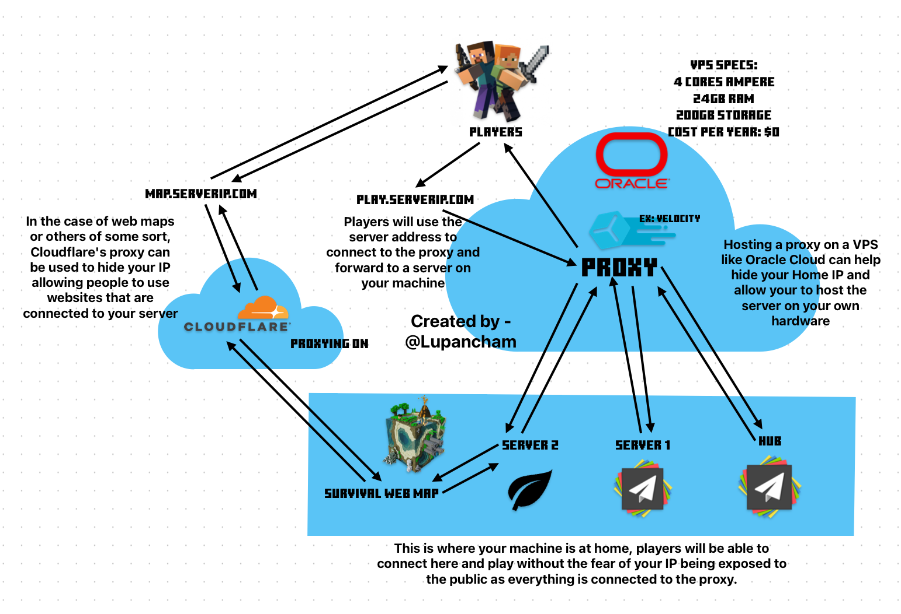
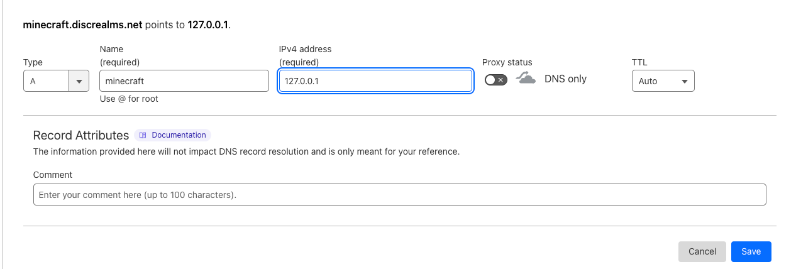
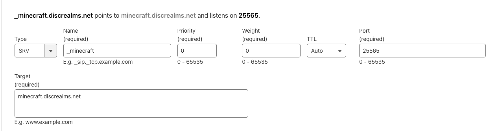
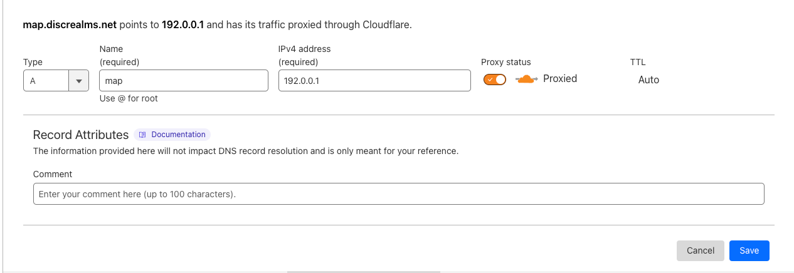
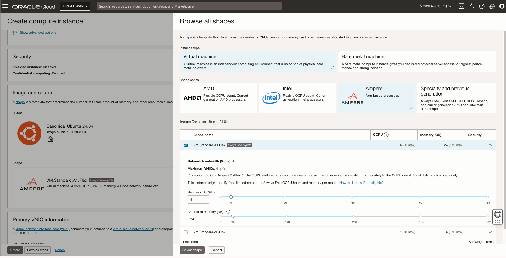
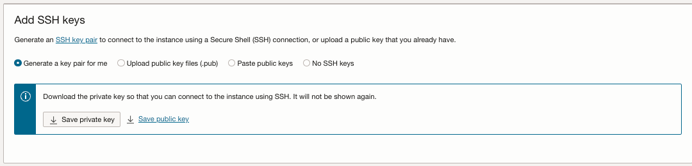
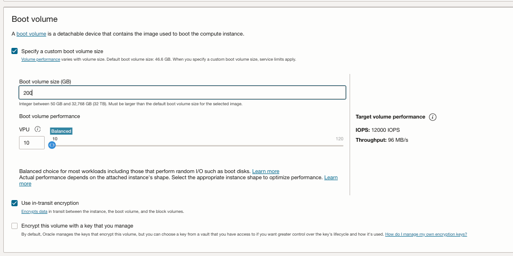

**With the chart provided as reference to how the whole system works, I will also explain how to setup a proxy on Oracle Cloud (Panel Setup Not Included), connect them to your home servers, and hide your IP when hosting web maps or others of the sort.**



**PREREQUISITES**
- A VPS/Server Host to host your Velocity server on.
- Ports that the servers at your home are using are open.
- Your Domain on cloudflare (If you plan to use a web map or other of some sort)


**THIS IS ASSUMING YOU HAVE ALL OF YOUR HOME SERVERS READY**
# Part 1 - Setting up a Proxy **(Using Velocity)**
As usual, you should setup your proxy in a normal based on the panel you use or without.

After you have set up and turned on your proxy, you can shut it back down and go to ``velocity.toml`` and look for this:
```
[servers]
# Configure your servers here. Each key represents the server's name, and the value
# represents the IP address of the server to connect to.
survival = "ExampleIP:Port"

# In what order we should try servers when a player logs in or is kicked from a server.
try = [
    "survival"
]
```
And you want to change this to connect to your servers IP and Port, for example:
```
[servers]
# Configure your servers here. Each key represents the server's name, and the value
# represents the IP address of the server to connect to.
survival = "127.0.0.1:25565"
skyblock = "127.0.0.1:25566"
lobby = "127.0.0.1:25567"

# In what order we should try servers when a player logs in or is kicked from a server.
try = [
    "lobby"
]
```
After you have added all of your servers, add the key from ``forwarding.secret`` to your servers that you want on the proxy.

Restart/boot up all connected servers including the Proxy.


# Part 2 - Configuring Domains (A Records)
**ASSUMING YOU ARE GOING TO USE A WEB MAP**
**(ONLY NEEDING A RECORDS WILL ONLY WORK IF YOUR VELOCITY SERVER PORT IS 25565)**
Go to your DNS records and create a new DNS record. You are going to point the root or a subdomain to your Proxy server IP with **PROXY STATUS OFF**



**IF YOUR VELOCITY SERVER ISN'T ON PORT 25565**
Create a ``srv record`` and have it point to your ``A record`` with the name being ``_minecraft`` with the ``priority as 0``, the ``weight as 0`` and the ``port set to your proxy port``.



# Part 3 - Completion for having a proxy, webmap now?
Congrats, you know have a proxy that allows players to connect yo your home servers without needing to give away your IP! However, if you wish to have things like webmaps, we are not done yet.

Lets say you want to have Dynmap on your survival server, you can pull this off by creating a A record and point it to your webmap address on **YOUR** IP.
> "But Lupan, wouldn't that defeat the purpose of a proxy?"
> 
> Holdon there, I didn't finish yet.

When you create your A record you will need to turn on the **Proxy Status** which will allow you to hide your IP behind cloudflare and still allow you to have the web map, here's an example of how a ``A record`` for this is created (The image is provided below)

When you need to give the website to the web map to your players, **Make SURE** to give the website link like this ``https://map.exampledomain.net:[THE PORT TO THE WEBMAP]`` giving the link as is will not connect them to the web map! Unless your web map is hosted on port ``80 (HTTP)`` or ``443 (HTTPS)``  and you know how to get either HTTP or HTTPS on your web map.



# Resources

### Oracle Cloud: 
https://www.oracle.com/cloud/  (You will be charged $1-10 to verify yourself but it will be refunded shortly)
It is recommended that you upgrade to ``Pay as you go account``, you will be given a temporary charge of $100 which is refunded shortly. For location choose a US location or Frankfurt, Germany for Europe as they are the only places I know of with free A1 instances. Upgrading to ``Pay as you go`` lets you access the free resources that that were shown as not available to ``always free`` accounts. You will not be charged for this unless you go over these limits for the A1 instance:
- 4 cores
- 24GB ram
- 200GB storage
  **MAKE SURE YOU DOWNLOAD THE SSH KEYS AND DO NOT LOSE THEM, THEY ARE REQUIRED FOR YOU TO CONNECT TO THE INSTANCE**
  Use this to help you connect to your instance: https://docs.oracle.com/en-us/iaas/Content/Compute/Tasks/connect-to-linux-instance.htm#top

<details>
<summary>Click to see OCI Instance Creation</summary>



</details>

Cloudflare: https://cloudflare.com/

Porkbun (Good place to grab domains): https://porkbun.com/

Pterodactyl Panel (Good for managing servers on the vps and your home server): https://pterodactyl.io/

Eggs for Minecraft server brands that you can add to Pterodactyl: https://github.com/pelican-eggs/eggs/tree/master/game_eggs/minecraft

> From ``Skullians [buape.com]`` (aka ``skullians`` on Admincraft discord) : 
> 
> I would mention that if you are running servers in docker or using a panel that uses docker such as pterodactyl, you should use the internal 172.18.0.1 IP https://pterodactyl.io/community/games/minecraft.html
